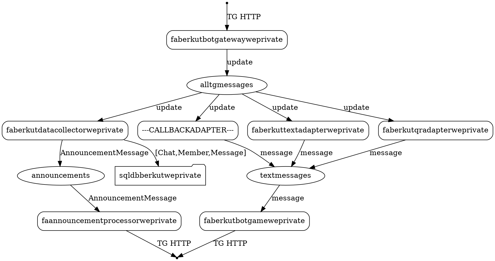

![Data flow](https://g.gravizo.com/svg?digraph%20finite_state_machine%20%7B%0A%20%20%20%20rankdir%3DTB%3B%0A%0A%20%20%20%20node%20%5Bshape%20%3D%20point%20%5D%3B%20start%3B%0A%20%20%20%20node%20%5Bshape%20%3D%20box%2C%20style%20%3D%20rounded%2C%20label%20%3D%20%22faberkutbotgatewayweprivate%22%5D%3B%20Gateway%3B%0A%20%20%20%20node%20%5Bshape%20%3D%20ellipse%2C%20label%20%3D%20%22alltgmessages%22%5D%3B%20AllTgMessages%3B%0A%20%20%20%20node%20%5Bshape%20%3D%20box%2C%20style%20%3D%20rounded%2C%20label%20%3D%20%22faberkutdatacollectorweprivate%22%2C%20group%20%3D%20%22adapters%22%5D%3B%20DataCollector%3B%0A%20%20%20%20node%20%5Bshape%20%3D%20box%2C%20style%20%3D%20rounded%2C%20label%20%3D%20%22---CALLBACKADAPTER---%22%2C%20group%20%3D%20%22adapters%22%5D%3B%20CallbackAdapter%3B%0A%20%20%20%20node%20%5Bshape%20%3D%20box%2C%20style%20%3D%20rounded%2C%20label%20%3D%20%22faberkuttextadapterweprivate%22%2C%20group%20%3D%20%22adapters%22%5D%3B%20TextAdapter%3B%0A%20%20%20%20node%20%5Bshape%20%3D%20box%2C%20style%20%3D%20rounded%2C%20label%20%3D%20%22faberkutqradapterweprivate%22%2C%20group%20%3D%20%22adapters%22%5D%3B%20QrAdapter%3B%0A%20%20%20%20node%20%5Bshape%20%3D%20ellipse%2C%20label%20%3D%20%22textmessages%22%5D%3B%20TextMessages%3B%0A%20%20%20%20node%20%5Bshape%20%3D%20box%2C%20style%20%3D%20rounded%2C%20label%20%3D%20%22faberkutbotgameweprivate%22%5D%3B%20AnswerProcessor%3B%0A%20%20%20%20node%20%5Bshape%20%3D%20ellipse%2C%20label%20%3D%20%22announcements%22%5D%3B%20Announcements%3B%0A%20%20%20%20node%20%5Bshape%20%3D%20box%2C%20style%20%3D%20rounded%2C%20label%20%3D%20%22faannouncementprocessorweprivate%22%5D%3B%20AnnouncementProcessor%3B%0A%20%20%20%20node%20%5Bshape%20%3D%20folder%2C%20label%20%3D%20%22sqldbberkutweprivate%22%20%5D%3B%20SqlDb%3B%0A%20%20%20%20node%20%5Bshape%20%3D%20point%20%5D%3B%20end%3B%0A%20%20%20%20%0A%20%20%20%20start%20-%3E%20Gateway%20%5B%20label%20%3D%20%22TG%20HTTP%22%20%5D%3B%0A%20%20%20%20Gateway%20-%3E%20AllTgMessages%20%5B%20label%20%3D%20%22update%22%20%5D%3B%0A%20%20%20%20AllTgMessages%20-%3E%20DataCollector%20%5B%20label%20%3D%20%22update%22%20%5D%3B%0A%20%20%20%20AllTgMessages%20-%3E%20CallbackAdapter%20%5B%20label%20%3D%20%22update%22%20%5D%3B%0A%20%20%20%20AllTgMessages%20-%3E%20TextAdapter%20%5B%20label%20%3D%20%22update%22%20%5D%3B%0A%20%20%20%20AllTgMessages%20-%3E%20QrAdapter%20%5B%20label%20%3D%20%22update%22%20%5D%3B%0A%20%20%20%20CallbackAdapter%20-%3E%20TextMessages%20%5B%20label%20%3D%20%22message%22%20%5D%3B%0A%20%20%20%20TextAdapter%20-%3E%20TextMessages%20%5B%20label%20%3D%20%22message%22%20%5D%3B%0A%20%20%20%20QrAdapter%20-%3E%20TextMessages%20%5B%20label%20%3D%20%22message%22%20%5D%3B%0A%20%20%20%20TextMessages%20-%3E%20AnswerProcessor%20%5B%20label%20%3D%20%22message%22%20%5D%3B%0A%20%20%20%20AnswerProcessor%20-%3E%20end%20%5B%20label%20%3D%20%22TG%20HTTP%22%20%5D%3B%0A%20%20%20%20DataCollector%20-%3E%20Announcements%20%5B%20label%20%3D%20%22AnnouncementMessage%22%20%5D%3B%0A%20%20%20%20DataCollector%20-%3E%20SqlDb%20%5B%20label%20%3D%20%22%5BChat%2CMember%2CMessage%5D%22%20%5D%3B%0A%20%20%20%20Announcements%20-%3E%20AnnouncementProcessor%20%5B%20label%20%3D%20%22AnnouncementMessage%22%20%5D%3B%0A%20%20%20%20AnnouncementProcessor%20-%3E%20end%20%5B%20label%20%3D%20%22TG%20HTTP%22%20%5D%3B%0A%7D)

