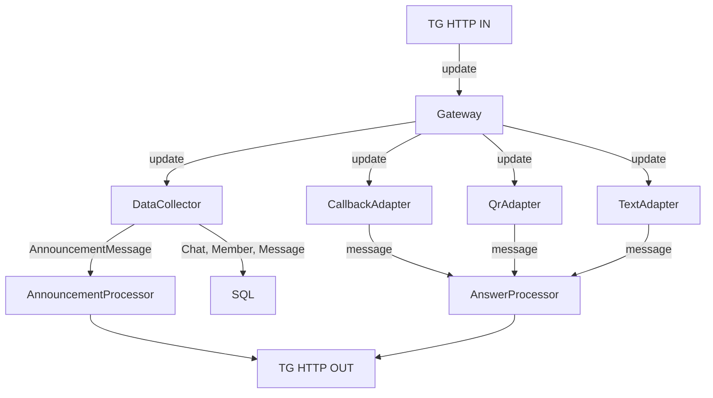

```mermaid
graph TD
    A[TG HTTP IN] --> | update | B
    B[Gateway]
    C[DataCollector]
    D[CallbackAdapter]
    E[TextAdapter]
    F[QrAdapter]
    G[AnnouncementProcessor]
    H[SQL]
    B --> | update | C
    B --> | update | D
    B --> | update | E
    B --> | update | F
    C --> | AnnouncementMessage | G
    C --> | Chat, Member, Message | H
    G --> Z
    D --> | message | I
    I[AnswerProcessor] --> Z
    F --> | message | I
    E --> | message | I
    Z[TG HTTP OUT]
```