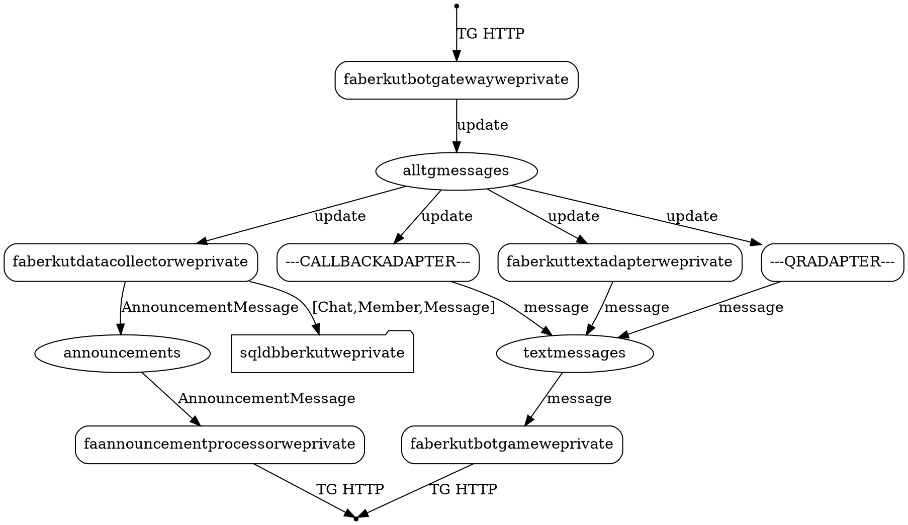

```graphviz
digraph finite_state_machine {
    rankdir=TB;


    node [shape = point ]; start;
    node [shape = box, style = rounded, label = "faberkutbotgatewayweprivate"]; Gateway;
    node [shape = ellipse, label = "alltgmessages"]; AllTgMessages;
    node [shape = box, style = rounded, label = "faberkutdatacollectorweprivate", group = "adapters"]; DataCollector;
    node [shape = box, style = rounded, label = "---CALLBACKADAPTER---", group = "adapters"]; CallbackAdapter;
    node [shape = box, style = rounded, label = "faberkuttextadapterweprivate", group = "adapters"]; TextAdapter;
    node [shape = box, style = rounded, label = "---QRADAPTER---", group = "adapters"]; QrAdapter;
    node [shape = ellipse, label = "textmessages"]; TextMessages;
    node [shape = box, style = rounded, label = "faberkutbotgameweprivate"]; AnswerProcessor;
    node [shape = ellipse, label = "announcements"]; Announcements;
    node [shape = box, style = rounded, label = "faannouncementprocessorweprivate"]; AnnouncementProcessor;
    node [shape = folder, label = "sqldbberkutweprivate" ]; SqlDb;
    node [shape = point ]; end;
    
    start -> Gateway [ label = "TG HTTP" ];
    Gateway -> AllTgMessages [ label = "update" ];
    AllTgMessages -> DataCollector [ label = "update" ];
    AllTgMessages -> CallbackAdapter [ label = "update" ];
    AllTgMessages -> TextAdapter [ label = "update" ];
    AllTgMessages -> QrAdapter [ label = "update" ];
    CallbackAdapter -> TextMessages [ label = "message" ];
    TextAdapter -> TextMessages [ label = "message" ];
    QrAdapter -> TextMessages [ label = "message" ];
    TextMessages -> AnswerProcessor [ label = "message" ];
    AnswerProcessor -> end [ label = "TG HTTP" ];
    DataCollector -> Announcements [ label = "AnnouncementMessage" ];
    DataCollector -> SqlDb [ label = "[Chat,Member,Message]" ];
    Announcements -> AnnouncementProcessor [ label = "AnnouncementMessage" ];
    AnnouncementProcessor -> end [ label = "TG HTTP" ];
}
```